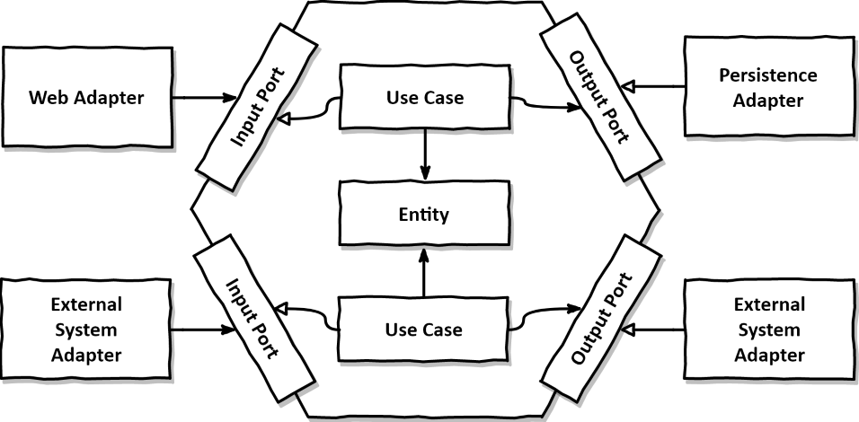

# About Payment System Architecture 


## Inside World
### Domain(Entity)
hexagonal 아키텍처의 중심은 애플리케이션의 비즈니스 로직과 규칙을 포함하는 도메인 계층이 있다. 이 계층은 응집력이 높고 외부 시스템이나 프레임워크와 독립적이다. 순수한 비즈니스 로직을 포함하며 비즈니스 요구사항과 관련된 변경만 허용한다.

```rust
// Example of a Domain entity 
#[derive(Debug, Clone)]
pub struct Payment {
    pub id: Uuid,
    pub amount: f64,
    pub currency: String,
    pub status: PaymentStatus,
}

#[derive(Debug, Clone)]
pub enum PaymentStatus {
    Pending,
    Completed,
    Failed,
}
```

### Usecase
Usecase 계층은 Domain이 수행할 수 있는 작업을 추상화한다. Domain 및 외부 레이어(Adapter, Port)와의 데이터 흐름을 조정한다. 

```rust 
// Example of a Usecase in Rust
pub struct ProcessPayment {
    pub payment_repository: Box<dyn PaymentRepository>,
}

impl ProcessPayment {
    pub async fn execute(&self, payment: Payment) -> Result<(), PaymentError> {
        // Business logic to process a payment
    }
}
```

## Outside World
### Port
도메인이 외부 세계와 상호 작용하는 방식을 정의하는 인터페이스 또는 추상화 레이어이다. 외부와의 모든 통신은 Port를 통해 이루어진다. 어떻게 외부 시스템과 상호작용하냐에 따라서 Input, Output으로 구분한다. 

#### Input
Input은 API 요청이나 CLI와 같이 시스템 내부로 들어오는 외부 시스템과의 송수신하는 역할을 한다. 
```rust
// Input Port (like CQRS pattern)
#[async_trait]
pub trait PaymentCommand {
    async fn create_payment(&self, create_payment_payload: CreatePaymentPayload) -> Result<PaymentResponse>;
}
```

#### Output
Output은 DB나 이벤트 메시징 시스템과 같이 외부 시스템과 상호작용하는 역할을 한다. 
```rust
// Output Port
#[async_trait]
pub trait PaymentRepository {
    async fn save(&self, create_payment_payload: CreatePaymentPayload) -> Result<PaymentResponse>;
}
```

입력 쪽은 결제 시스템으로 들어오는 외부 상호작용을 처리합니다. 여기에는 API 호출 또는 명령 수신이 포함됩니다.

### Adapter
Adapter는 Port의 구현체이다. 외부 시스템의 데이터와 요청을 Domain이 이해하고 처리할 수 있는 형태로 변환한다.

```rust
// Input Adapter 
impl PaymentCommand for PaymentCommandImpl {
        async fn create_payment(&self, create_payment_payload: CreatePaymentPayload) -> Result<PaymentResponse> {
        // 추상화된 Domain 구현체(usecase)를 통해 데이터를 처리하는 로직

        Ok(Json(paymentResponse))
    }
}
```

```rust
// Output Adapter
#[async_trait]
impl PaymentRepository for PaymentRepositoryImpl {
    async fn save(&self, create_payment_payload: CreatePaymentPayload) -> Result<PaymentResponse> {
        // DB에 payment를 저장하는 로직 

        Ok(Json(paymentResponse))
    }
}
```

## Resources
- Damir Svrtan and Sergii Makagon, [Ready for changes with Hexagonal Architecture](https://netflixtechblog.com/ready-for-changes-with-hexagonal-architecture-b315ec967749), Neflix Tech Blog